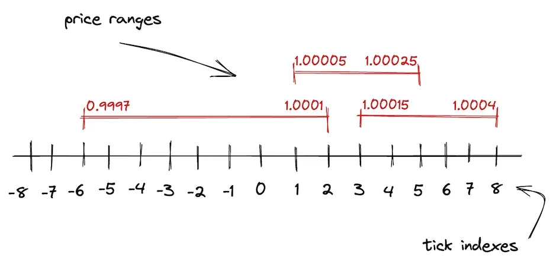
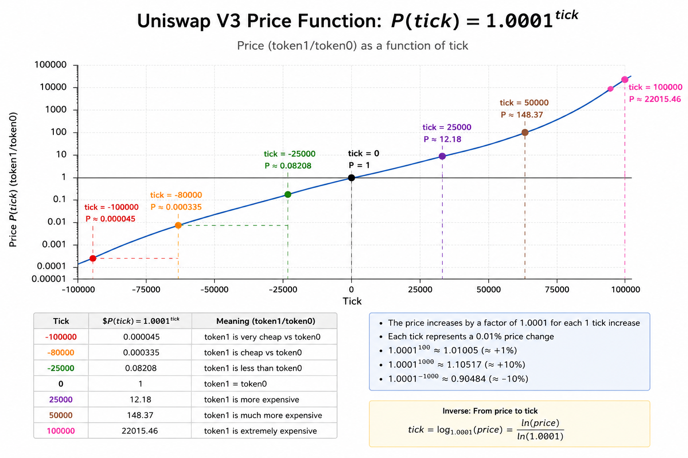

## Dex Swap (Uniswap V3) Architecture
```
       ┌────────────────────────────────────────────────────────┐
       │                     USER / WALLET                      │
       └───────────────────────────┬────────────────────────────┘
                                   │
                    Interacts via Periphery Contracts
                                   │
                                   ▼
┌────────────────────────────────────────────────────────────────────────┐
│                          PERIPHERY LAYER                               │
│                                                                        │
│   ┌──────────────────────────────┐    ┌────────────────────────────┐   │
│   │     NonfungiblePosition-     │    │        SwapRouter          │   │
│   │        Manager (NPM)         │    │  (Executes exact input/    │   │
│   │ (Mints & tracks LP ranges as │    │   output swaps across      │   │
│   │      ERC-721 NFT tokens)     │    │     multiple pools)        │   │
│   └──────────────┬───────────────┘    └─────────────┬──────────────┘   │
└──────────────────┼──────────────────────────────────┼──────────────────┘
                   │                                  │
                   │  Calls Mint/Burn/Swap            │
                   ▼                                  ▼
┌────────────────────────────────────────────────────────────────────────┐
│                            CORE LAYER                                  │
│                                                                        │
│   ┌────────────────────────────────────────────────────────────────┐   │
│   │                       UniswapV3Pool                            │   │
│   │                                                                │   │
│   │  ┌───────────────────────┐            ┌─────────────────────┐  │   │
│   │  │     Asset Ledger      │            │   Boundary Tracker  │  │   │
│   │  │ • Holds actual tokens │            │ • Maps active price │  │   │
│   │  │   for the pair        │            │   liquidity ranges  │  │   │
│   │  └───────────────────────┘            └─────────────────────┘  │   │
│   │                                                                │   │
│   │  ┌───────────────────────┐            ┌─────────────────────┐  │   │
│   │  │   Price Data Vault    │            │     Fee Splitter    │  │   │
│   │  │ • Stores historical   │            │ • Accounts for and  │  │   │
│   │  │   price records       │            │   allocates trader  │  │   │
│   │  └───────────────────────┘            │   fees to LPs       │  │   │
│   │                                       └─────────────────────┘  │   │
│   └───────────────────────────────▲────────────────────────────────┘   │
└───────────────────────────────────┼────────────────────────────────────┘
                                    │
                         Deploys Pool Contracts
                                    │
┌───────────────────────────────────┴────────────────────────────────────┐
│                          FACTORY & ORACLES                             │
│                                                                        │
│   ┌──────────────────────────────┐    ┌────────────────────────────┐   │
│   │      UniswapV3Factory        │    │    Third-Party Apps        │   │
│   │                              │    │                            │   │
│   │ • Deploys new pools          │    │ • Reads price histories    │   │
│   │ • Acts as main registry      │    │ • Integrates pool data     │   │
│   │ • Sets official fee tiers    │    │   into external protocols  │   │
│   └──────────────────────────────┘    └────────────────────────────┘   │
└────────────────────────────────────────────────────────────────────────┘

```

## Important Concepts
### `Tick`
The smallest possible upward or downward price movement of a traded asset.

  - How price is represent in Uniswap V3: `price = token1/token0`
    ```
    真实价格
    ↓
    price = token1/token0
    ↓
    换算成 tick
    ↓
    再转成 sqrtPriceX96 = sqrt(1.0001^tick) * 2^96
    ```
  - Example: ETH/USDT = 1/3000
    | tick     | price    |
    |----------|----------|
    | 0        | 1        |
    | 1        | 1.0001   |
    | 2        | 1.0002   |
    | ...      | ...      |
    | -80067   | 1/3000   |

    

### `TickSpacing`
The minimum interval between valid ticks. Basically means “you can only place liquidity on certain tick intervals,” like only every 60 ticks, instead of every single tick, which keeps the pool cheaper and more efficient to manage. V3 规定只有被 tickSpacing 整除的 tick 才允许被初始化. tickSpacing 越大，每个 tick 流动性越多，tick 之间滑点越大，但会节省跨 tick 操作的 gas。

- Fee tiers and tickSpacing
    | tick     | tickSpacing |
    |----------|-------------|
    | 0.01%    | 1           |
    | 0.05%    | 10          |
    | 0.3%     | 60          |
    | 1%       | 200         |

### `crossing tick`
价格穿过一个流动性边界。V3 中LP 不是全区间提供流动性。而是：

```
[tickLower, tickUpper]
```

例如：

```
Alice:
[100, 200]
```

Alice 的 liquidity只在 tick 100 ~ 200 有效, 价格移动时会发生什么?

假设当前价格：

```
tick = 150
```

Alice liquidity 生效。现在有人大量买 ETH, 价格上涨:

```
150 -> 160 -> 170 -> ... -> 200 -> 201
```

当：

```
200 -> 201
```

这一瞬间crossing tick 200, 因为tick 200 是：

```
Alice liquidity range 的边界
```

价格越过后Alice liquidity不再有效,于是 V3 必须：

```
activeLiquidity -= AliceLiquidity
```

这就是crossing tick

### `Liquidity`
How much trading capacity an LP provides within a specific price range.
- In Uniswap v2, liquidity is spread across all prices, most capital sits unused.
- In Uniswap v3 idea: Concentracted liquidity. LPs choose a price range, example:
   - ETH price now = `$3000`, LP may provide liquidity only between: `$2500 and $3500`.
   - That means **deeper liquidity** near current price, **less slippage** and **higher fee efficiency**

What does liquidity means mathmatically?
- Let's say the LP provides liquidity beteen [p_a, p_b]. Value x is reserve of token0 and y is reserve of token1.
- `x * y = k and p = y / x`
- `L = sqrt(k)`
So `x = L / sqrt(p), y = L * sqrt(p)`

- When moving the current price p to p_b, token0 will be eventually used. That means `delta_x = L_0 / sqrt(p) - L_0 / sqrt(p_b)`. So **`L_0 = delta_x * sqrt(p) * sqrt(p_b) / (sqrt(p_b) - sqrt(p))`**
- When moving the current pice p to p_a, token1 will be used up. Thus `delta_y = L_1 * sqrt(p) - L_1 * sqrt(p_a)`. So **`L_1 = delta_y / (sqrt(p) - sqrt(p_a))`**
- The liquidity **`L = min(L_0, L_1)`**